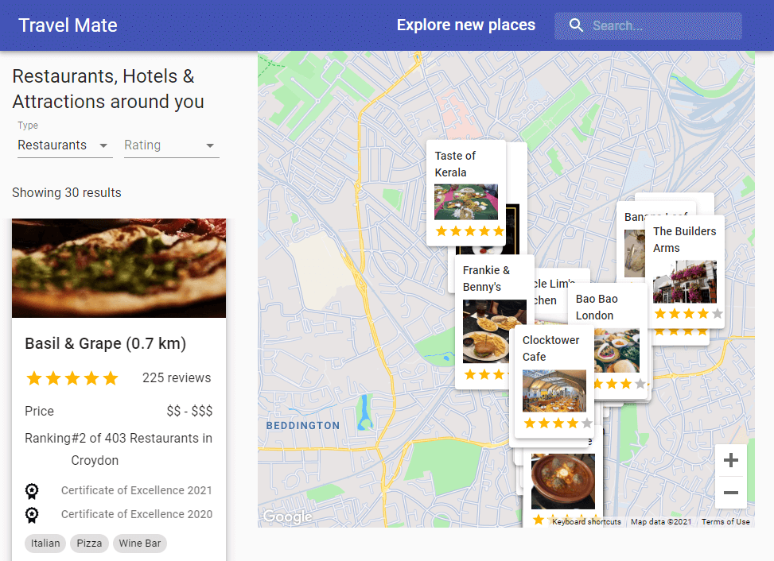

# Travel Mate

Google Maps travel companion that helps you find hotels, attractions, weather, and food & dining places around you using React with Material UI, Google Maps APIs, and Rapid API.

## Demo

[https://travellingmate.netlify.app/](https://travellingmate.netlify.app/)

# Local launch

0. Clone repo: `git clone https://github.com/AbayIbrayev/travel-mate.git`
1. `cd travel-mate`
2. Install dependencies with `yarn` or `npm install`
3. Set up your own environment variable using [Google Maps API](https://console.cloud.google.com/) and [Rapid API](https://rapidapi.com/apidojo/api/travel-advisor/), shown in .envSAMPLE file
4. Run your server with `yarn start` | `npm start` (check [localhost:5000](http://localhost:5000/))
5. Run your client side with `yarn start` | `npm start`
6. Check your `localhost:3000`, for a local preview

---

Thank you!
